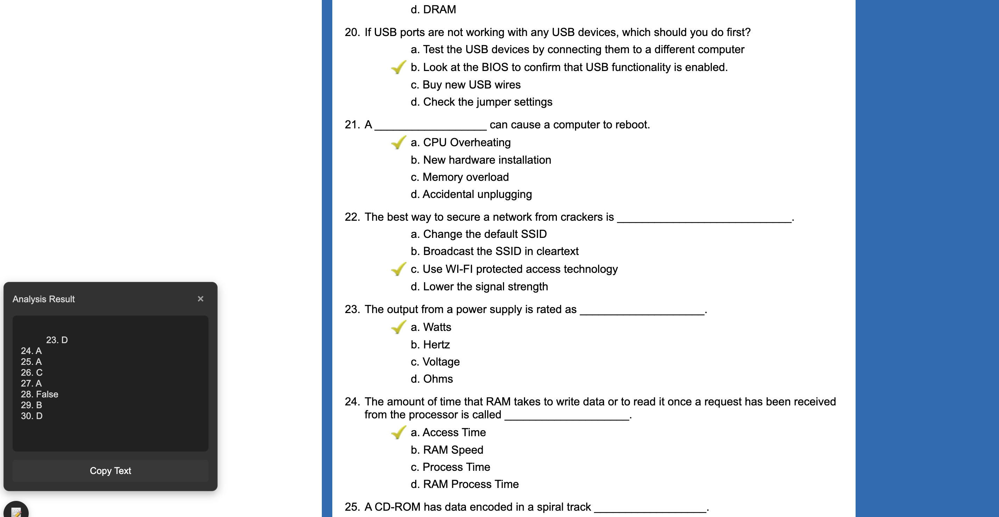
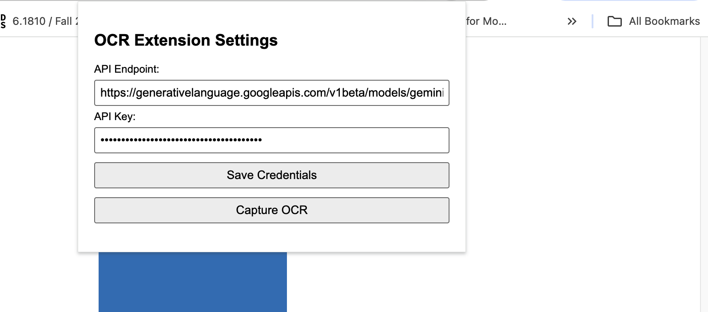

## Quiz solver

setting configs

Solve quizes via llm api. How?

1. Capture the screen using chrome runtime api
2. Send the capture to Tesseract ocr
3. Pass the generated text to llm api
4. print the answer

The app try as much to be un-detectable via

- Entity proxy: the app is names differently entirely
- Uses shadowDom
- Api request to llm via background

Note that this not ensure that the app is 100% or even close 90% un-detectable. Be careful out there.

### Acknowledgement

Embedding tesseract into chrome extension seems to be a pain in the ass, csp issues and the likes. But this [repo](https://github.com/Tshetrim/Image-To-Text-OCR-extension-for-ChatGPT) solve that by embeeding tesseract directly instead of using cdn. Hence this account for the extension file size.
